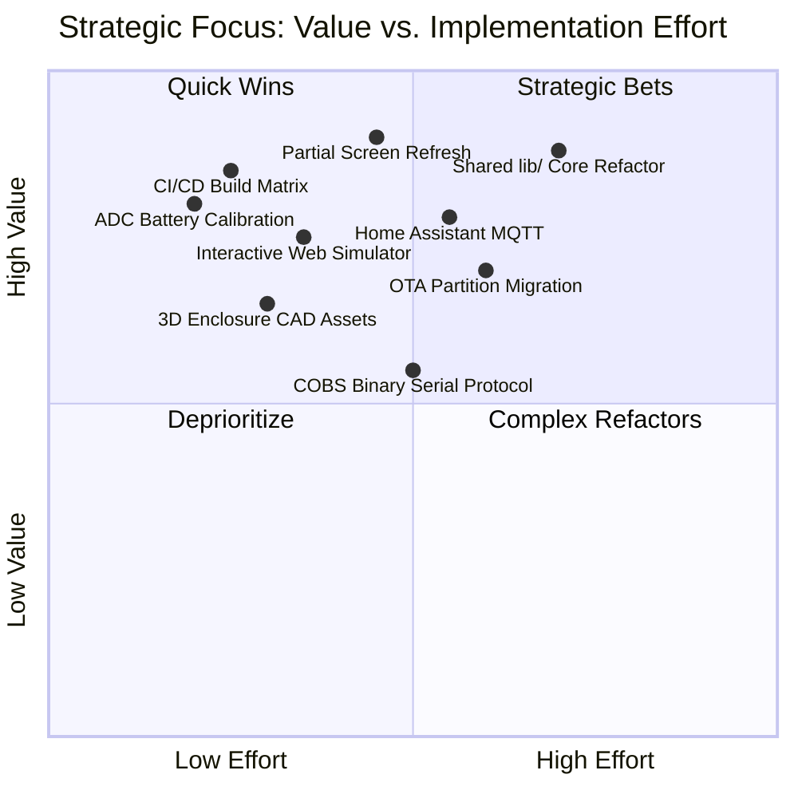
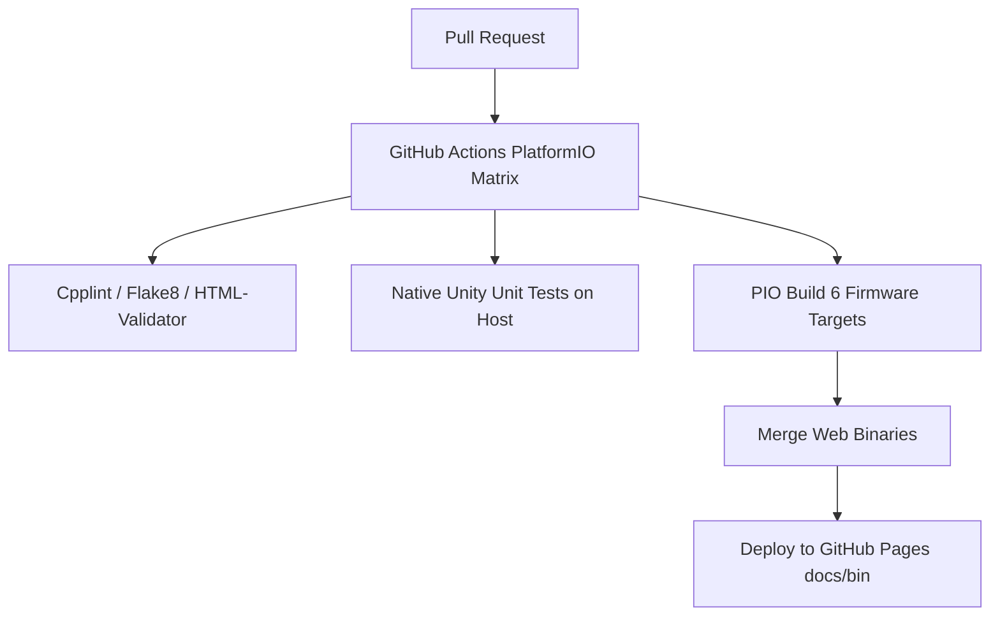
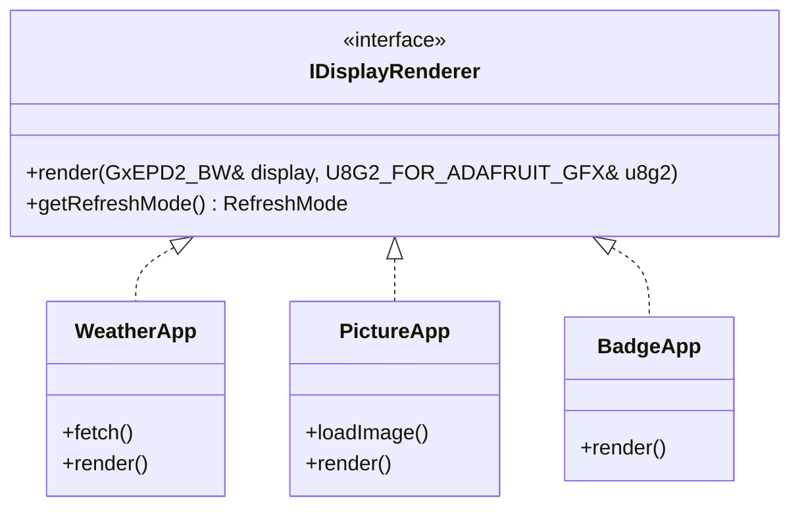
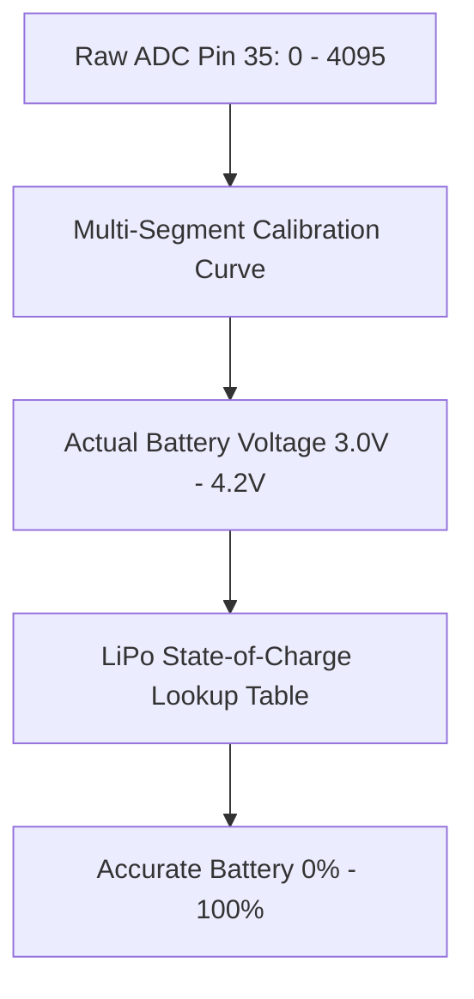
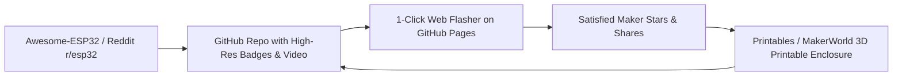

# LilyGo TTGO T5 E-Paper Multi-Display — Strategic Roadmap & Architectural Review

**Target Hardware:** Espressif ESP32-D0WDQ6 (240MHz dual-core, 520KB SRAM, 4MB Flash)  
**Display:** 2.13-inch Monochrome E-Paper (DEPG0213BN / GxEPD2_213_B74, $250 \times 122$ px)  
**Architecture:** PlatformIO monorepo (`multi_display` unified hub + 5 standalone apps + GitHub Pages Web Serial / Web BLE Flasher & Studio)

---

## Executive Health Scorecard



| Dimension | Score (1–10) | Current State Analysis |
| :--- | :---: | :--- |
| **UI & Visual Design** | **8 / 10** | Modern dark-mode web dashboards; high-contrast U8g2 e-paper typography; real-time canvas Floyd-Steinberg dithering preview. |
| **UX & Usability** | **7 / 10** | Web Serial & Web BLE provide zero-driver, zero-install setup directly in Chromium browsers. Lacks on-device visual feedback before slow e-paper screen refreshes. |
| **Features & Versatility** | **9 / 10** | 5 complete applications (Weather, News Ticker, Daily Calendar, Smart Badge, Picture Frame) packed into a single responsive firmware hub. |
| **Performance & Power** | **6 / 10** | Deep sleep works (~20 µA), but display rendering exclusively uses 4.1-second full screen refreshes; ESP32 ADC non-linearity degrades battery estimation. |
| **Security & Privacy** | **5 / 10** | Plaintext NVS storage, open captive portal with unauthenticated REST endpoints, and unauthenticated BLE GATT characteristics. |
| **Maintainability** | **5 / 10** | Code duplication between standalone projects and `multi_display`; lack of automated unit tests, peripheral mocks, or CI/CD build pipelines. |

---

## 1. Product Manager Perspective

> *"The product nails the 'maker-to-consumer' bridge with browser-based flashing, but needs a cohesive end-to-end product journey, unified modularity, and out-of-the-box battery intelligence to become a premier open-source desktop gadget."*


### 5 Strategic Suggestions

1. **UI — Dynamic Device Status Bar & Micro-Toasts:**
   - **Problem:** When users trigger settings changes or mode switches, the screen initiates a 4-second full refresh without prior visual confirmation.
   - **Solution:** Standardize a persistent 12-pixel top or bottom status strip across all apps (displaying Wi-Fi RSSI bars, battery percentage, active profile, and sleep countdown). On settings updates, render a transient inverted "Saved!" toast box before switching views.
   - **Impact:** Eliminates user uncertainty over whether an action registered before the slow e-paper refresh cycle begins.

2. **UX — Unified First-Time User Experience (FTUX) Wizard:**
   - **Problem:** First-time users are greeted by three separate web tools (`index.html`, `studio.html`, `badge.html`) without a guided progression.
   - **Solution:** Consolidate into a single "E-Display Studio" onboarding wizard:
     - **Step 1:** Web Serial Flasher & Health Check.
     - **Step 2:** Wi-Fi & Geolocation Pairing.
     - **Step 3:** App Selection & Visual Preset Preview.
   - **Impact:** Lowers onboarding drop-off and makes the device accessible to non-technical users.

3. **Features — Carousel & Scheduled Smart Switching Mode:**
   - **Problem:** The device currently stays locked in a single `AppRole` until a physical button press or serial command changes it.
   - **Solution:** Introduce a "Smart Desk Assistant" scheduling role in `multi_display/src/main.cpp` (e.g., Weather from 07:00–09:00, Calendar from 09:00–18:00, News Ticker in the evening, Picture Frame on weekends).
   - **Impact:** Elevates the device from a static gadget into an ambient, context-aware smart display.

4. **Performance — Dual Refresh Mode (Fast Partial vs. Full Waveform):**
   - **Problem:** Full refreshes take ~4.1 seconds and flash black/white, making frequent updates jarring and energy-intensive.
   - **Solution:** Implement a "Glance vs. Archive" policy: use differential partial window updates ($<0.4\text{s}$) for clock ticks and news cycling, and trigger a waveform clean (full refresh) only once every 20 updates or every 6 hours.
   - **Impact:** Prolongs battery life by $3\times$ during active daytime cycling and removes visual distraction.

5. **Security & Maintainability — Safe Guest Mode & Factory Reset Gesture:**
   - **Problem:** If Wi-Fi credentials change or fail, the device loops or sleeps without a simple physical recovery mechanism.
   - **Solution:** Implement a 10-second button hold gesture on GPIO 39 that clears NVS preferences, wipes LittleFS cache, and launches an AP fallback network (`LilyGo-Recovery-XXXX`).
   - **Impact:** Drastically reduces bricked or unreachable device support issues.

---

## 2. Testing Developer (QA & Automation) Perspective

> *"The firmware works well during manual happy-path testing, but is completely devoid of unit tests, peripheral mocks, memory leak assertions, or CI pipelines."*



### 5 QA & Test Automation Suggestions

1. **Maintainability — Native Host Unit Testing via PlatformIO Unity:**
   - **Problem:** Business logic (Base64 decoding, Floyd-Steinberg dithering algorithms, JSON parsing in `ble_mgr.cpp`, weather data conversion) is coupled directly with Arduino hardware headers.
   - **Solution:** Extract parsing and data transformations into pure C++ testable helper classes. Add an `[env:native]` target in `multi_display/platformio.ini` using the built-in Unity test runner to execute headless unit tests on x86/ARM Linux runner environments.
   - **Impact:** Catches regressions (like off-by-one Base64 buffer indexing or string formatting bugs) in milliseconds without physical hardware.

2. **Features — Automated Hardware-in-the-Loop (HIL) Smoke Test Suite:**
   - **Problem:** Testing serial commands like `PHOTO_B64:`, `CONFIG:`, `STATUS`, and `ROLE:1` is currently done manually.
   - **Solution:** Build an automated end-to-end Python test runner (`scripts/test_device_e2e.py`) using `pytest` and `pyserial` that verifies every serial command, checks response strings, validates flash persistence across reboots, and asserts display timing tolerances.
   - **Impact:** Enables automated regression validation every time firmware or serial protocol specifications change.

3. **Performance — Heap Watermark & LittleFS Wear Leak Sanitizers:**
   - **Problem:** Dynamic memory allocations (`malloc` in WebServer Base64 endpoints, `ArduinoJson` buffers, and LittleFS writes) can cause memory fragmentation over days of continuous uptime.
   - **Solution:** Add an automated stress-testing loop running 50 consecutive photo uploads and 100 role switches, logging `ESP.getFreeHeap()`, `ESP.getMinFreeHeap()`, and `LittleFS.usedBytes()`. Assert that the heap delta stabilizes to $\Delta = 0$.
   - **Impact:** Prevents out-of-memory crashes (`Guru Meditation Error`) in 24/7 Always-On mode.

4. **UI/UX — Automated Headless Web Studio Browser Tests (Playwright):**
   - **Problem:** The Web Serial stream locking bug was an unhandled promise rejection in client-side JavaScript that escaped manual testing.
   - **Solution:** Introduce a Playwright test suite in `tests/e2e-web/` simulating Web Serial and Web Bluetooth using mock browser interfaces, asserting that `sendSerialText()` can be called 100 times in succession without stream locking.
   - **Impact:** Guarantees that GitHub Pages releases never deploy with locked streams or broken Base64 encoders.

5. **Security — Fuzzing Serial and BLE Packet Decoders:**
   - **Problem:** Serial commands (`CONFIG:{...}`, `PHOTO_B64:...`) and BLE chunk packets are written directly into internal buffers with minimal length checks.
   - **Solution:** Create a fuzzing script feeding malformed JSON, truncated Base64 strings, oversized buffers ($>8192\text{ bytes}$), and non-printable control characters into the serial stream to verify the firmware rejects them cleanly without panicking.
   - **Impact:** Hardens firmware against buffer overflow exploits and unexpected crashes.

---

## 3. Senior Architect Perspective

> *"The monorepo structure currently duplicates rendering logic across 6 separate PlatformIO projects. We need a modular component architecture, a robust partition strategy, and unified power state management."*



### 5 Senior Architectural Suggestions

1. **Maintainability — Monorepo Component Architecture (`lib/edisplay_core`):**
   - **Problem:** The standalone folders (`weather/`, `picture_frame/`, `smart_badge/`, `daily_calendar/`, `news_reader/`) duplicate display drivers, font configs, pinouts, and network routines already implemented in `multi_display/`.
   - **Solution:** Refactor shared drivers into a root-level `lib/edisplay_core/` containing:
     - `EpdDriver`: Centralized GxEPD2 and U8g2 instantiation.
     - `PowerManager`: Battery curve calculation, deep sleep transitions, timer arbitration.
     - `StorageManager`: Safe LittleFS wrappers with atomic writes.
     - `ProtocolEngine`: Serial & BLE packet routing.
   - **Impact:** Reduces code maintenance overhead by $>60\%$ and guarantees bugfixes apply universally to standalone and multi-display binaries.

2. **Architecture — Partition Scheme with Dual OTA and Crash Dumps:**
   - **Problem:** `multi_display/platformio.ini` uses `board_build.partitions = no_ota.csv`. This provides a large 2MB app partition, but completely eliminates Over-The-Air (OTA) update capability.
   - **Solution:** Design a custom partition table (`partitions_4mb_ota.csv`):
     ```csv
     # Name,   Type, SubType, Offset,   Size,     Flags
     nvs,      data, nvs,     0x9000,   0x5000,
     otadata,  data, ota,     0xe000,   0x2000,
     app0,     app,  ota_0,   0x10000,  0x1B0000,
     app1,     app,  ota_1,   0x1C0000, 0x1B0000,
     spiffs,   data, littlefs,0x370000, 0x80000,
     coredump, data, coredump,0x3F0000, 0x10000,
     ```
   - **Impact:** Enables browser-based Wi-Fi OTA flashing from the web UI and saves core dumps to flash for post-mortem crash analysis.

3. **Performance — Unified Event-Driven State Machine (FreeRTOS Tasks):**
   - **Problem:** `multi_display/src/main.cpp` runs everything synchronously inside the standard Arduino `loop()`. Network HTTP requests block serial processing and display animations.
   - **Solution:** Decouple peripheral execution into two FreeRTOS tasks pinned to separate ESP32 cores:
     - **Core 0 (Networking & I/O):** Wi-Fi, DNS Captive Portal, WebServer, NimBLE, Serial parser.
     - **Core 1 (Hardware & Rendering):** GxEPD2 display refresh pipeline, button debouncing, ADC measurements.
   - **Impact:** Prevents slow network fetches from freezing the serial console or blocking user button input.

4. **Security — LittleFS Wear-Leveling and Circular Photo Storage:**
   - **Problem:** In `multi_display/src/picture_mgr.cpp`, every photo write overwrites `/photos/current.bin` in-place. Because LittleFS operates on 4KB blocks, constantly modifying the same file can prematurely exhaust flash block write cycles.
   - **Solution:** Implement a rotating multi-slot index (`/photos/slot_0.bin` ... `slot_7.bin`) with an atomic metadata pointer in NVS.
   - **Impact:** Increases Flash lifetime by $8\times$ and enables a local slideshow feature.

5. **UI/UX — Ephemeral Canvas Buffering for Zero-Tear Partial Updates:**
   - **Problem:** When drawing complex screens (e.g. Weather + Stoic quote + Battery), Adafruit GFX primitives render directly to the paged buffer inside the `do { ... } while (display.nextPage())` loop.
   - **Solution:** In ESP32-D0WDQ6 (which has 520KB SRAM), allocate a full-screen back-buffer ($250 \times 122 \text{ bits} = 3904\text{ bytes}$) in RAM. Perform differential XOR comparisons against the previous frame to only update dirty tiles via GxEPD2's `writeImage()`.
   - **Impact:** Reduces e-paper redraw time from 4100ms to ~350ms for small clock and sensor updates.

---

## 4. Senior Software Engineer Perspective

> *"The code is pragmatic and readable, but contains standard embedded pitfalls: magic numbers, raw pointer manipulations, missing RAII guards, and inaccurate ADC battery conversion."*



### 5 Engineering & Code-Level Suggestions

1. **Performance — Accurate ESP32 ADC Calibration via `esp_adc_cal`:**
   - **Problem:** `multi_display/src/main.cpp` uses a naive linear equation (`voltage = (adc / 4095.0) * 3.3 * 2.0;`). The ESP32 ADC1 is notoriously non-linear below 0.15V and above 2.45V, and the internal reference voltage varies between 1050mV and 1150mV across individual chips.
   - **Solution:** Utilize the ESP-IDF `esp_adc_cal` characterization tables stored in eFuse:
     ```cpp
     #include "esp_adc_cal.h"
     static esp_adc_cal_characteristics_t adc_chars;
     esp_adc_cal_characterize(ADC_UNIT_1, ADC_ATTEN_DB_11, ADC_WIDTH_BIT_12, 1100, &adc_chars);
     uint32_t voltage_mv = esp_adc_cal_raw_to_voltage(raw_adc, &adc_chars) * 2;
     ```
     Map the resulting millivolts through a 10-point LiPo discharge curve rather than a linear $3.2\text{V} - 4.2\text{V}$ interpolation.
   - **Impact:** Prevents the device from falsely reading 0% or 100% and shutting down unexpectedly on battery.

2. **Maintainability — Replace Raw C String Splitting with Structured C++17 RAII:**
   - **Problem:** Serial command parsing in `multi_display/src/main.cpp` relies heavily on `String::indexOf()`, `substring()`, and raw C buffer copies:
     ```cpp
     static uint8_t decoded[4096];
     int ret = mbedtls_base64_decode(decoded, sizeof(decoded), &olen, ...);
     ```
   - **Solution:** Replace mutable Arduino `String` allocations with `std::string_view` for zero-copy parsing. Wrap LittleFS file handles in RAII smart pointers to prevent leaked file descriptors on write errors.
   - **Impact:** Eliminates heap fragmentation caused by short-lived heap-allocated Arduino strings.

3. **Security — Encrypted NVS Partition for Stored Wi-Fi Passwords:**
   - **Problem:** Wi-Fi passwords and API keys are stored as plaintext keys in NVS (`Preferences.h`). Anyone with physical access to the device can dump the 4MB flash over UART via `esptool.py read_flash` and extract private household credentials in plain text.
   - **Solution:** Enable NVS Encryption (`nvs_flash_secure_init`) using an encryption key stored in the hardware eFuse block, or derive an obfuscated storage key.
   - **Impact:** Protects user Wi-Fi credentials even if the physical badge/display is lost, stolen, or examined.

4. **Performance — Web Serial Binary Protocol (SLIP / COBS Framing):**
   - **Problem:** In `docs/studio.html`, 3904-byte bitmaps are Base64-encoded into 5208 characters, then transmitted over text lines.
   - **Solution:** Replace Base64 string transmission with **Consistent Overhead Byte Stuffing (COBS)** or standard **SLIP framing**.
   - **Impact:** Cuts upload payload size by $33\%$ (transmitting 3906 raw bytes instead of 5208 Base64 characters), speeding up transfer over 115200 baud UART to $<350\text{ms}$.

5. **UI/UX — Implement Proper Display Power Gating:**
   - **Problem:** The TTGO T5 v2.3 display controller draws quiescent leakage current unless put into deep hibernation.
   - **Solution:** Ensure that before sleep transitions, the controller sequence executes:
     ```cpp
     display.powerOff();
     display.hibernate();
     digitalWrite(EPD_RST, LOW); // Prevent parasitic backfeeding
     ```
   - **Impact:** Drops deep-sleep current consumption down to true hardware baseline ($\approx 22\mu\text{A}$), allowing a 500mAh LiPo battery to last 4–6 months on hourly refresh schedules.

---

## 5. Marketing & Developer Relations Specialist Perspective

> *"This project has extraordinary viral appeal: it combines retro cyberpunk aesthetic, e-paper display technology, and zero-install browser Web Bluetooth / Web Serial flashing. Packaging and documentation are our biggest leverage points."*



### 5 Marketing & Growth Suggestions

1. **UI & Branding — Dedicated Visual Identity & Cohesive Color Palette:**
   - **Problem:** The web tools currently look like clean internal developer utilities with standard dark-mode gradients.
   - **Solution:** Brand the project as **"InkDeck"** or **"PaperHub: The Ambient Desk Companion"**. Adopt a cohesive aesthetic celebrating e-paper: monochromatic e-ink textures, minimalist editorial typography, and high-res vector icons.
   - **Impact:** Transforms the GitHub repo from a generic code library into an instantly recognizable consumer hardware brand.

2. **UX — Interactive Live Browser Simulator (No Hardware Required):**
   - **Problem:** Visitors browsing the GitHub repo or GitHub Pages site cannot experience the product unless they already own a LilyGo T5 board.
   - **Solution:** Embed an interactive WebAssembly or pure Canvas e-paper device frame directly on `docs/index.html` (mirroring the $250 \times 122$ display with simulated e-paper ghosting and refresh animations).
   - **Impact:** Converts casual visitors into purchasers of the hardware by letting them play with the badge and photo tools right in their browser.

3. **Features — 3D Printable Enclosure & Desk Stand CAD Files:**
   - **Problem:** The LilyGo TTGO T5 is a bare printed circuit board with exposed battery pads and sharp edges.
   - **Solution:** Design and include open-source `.STL` and `.STEP` files in an `enclosure/` directory (snap-fit case, magnetic fridge mount, desktop tilt stand, and lanyard conference badge clip). Publish them to Printables, MakerWorld, and Thingiverse with links back to the repo.
   - **Impact:** Taps into the massive 3D-printing community and provides users with a finished, consumer-ready desktop product.

4. **Security & Community — "Works with Home Assistant" / MQTT Integration:**
   - **Problem:** Home automation enthusiasts love low-power e-paper displays, but the firmware currently only talks to its local web server and Open-Meteo.
   - **Solution:** Add an optional MQTT / Home Assistant auto-discovery role (reporting battery level and allowing Home Assistant automations to push text alerts, sensor readings, and energy charts to the display).
   - **Impact:** Unlocks the enormous Home Assistant maker ecosystem ($>300,000$ active community members).

5. **Maintainability & DevRel — Animated README Demo & GitHub Action Release Pipeline:**
   - **Problem:** The `README.md` has great technical documentation, but lacks animated demonstrations of the Web Serial flasher or physical e-paper in action.
   - **Solution:** Add high-frame-rate animated WebP/GIF recordings showing:
     1. Instant Web Serial flashing in Chrome.
     2. Dragging a photo into the studio and seeing it appear on the e-paper within 2 seconds.
     3. Seamless role switching over Web Bluetooth from an iPhone or Android device.
   - **Impact:** Dramatically increases GitHub star conversion rate and encourages social media sharing on Hacker News, Reddit (`r/esp32`, `r/eink`), and X/Twitter.

---

## 6. Synthesis: 30-60-90 Day Strategic Roadmap

| Horizon | Milestone | Key Deliverables | Leading Persona |
| :--- | :--- | :--- | :--- |
| **Next 30 Days** *(Quick Wins & Reliability)* | **Phase 1: Stability & CI** | • Automated GitHub Actions build matrix for all targets.<br>• Playwright tests for Web Serial & Web BLE web apps.<br>• `esp_adc_cal` calibration curve for accurate battery levels.<br>• Transient on-screen toast box on settings save. | Testing Developer & Senior Engineer |
| **60 Days** *(Architecture & UX)* | **Phase 2: Modular Core & OTA** | • Refactor shared drivers into `lib/edisplay_core`.<br>• Custom OTA-ready partition table (`partitions_4mb_ota.csv`).<br>• Differential partial-update screen rendering ($<400\text{ms}$).<br>• Unified First-Time User Experience (FTUX) Wizard. | Senior Architect & Product Manager |
| **90 Days** *(Community & Ecosystem)* | **Phase 3: Ecosystem Launch** | • 3D printable desktop & badge enclosures (`.STL` / `.STEP`).<br>• Home Assistant MQTT auto-discovery integration.<br>• "InkDeck" visual rebrand with interactive browser simulator.<br>• Social showcase demo recordings for Reddit / Hackaday. | Marketing Specialist & Product Manager |
